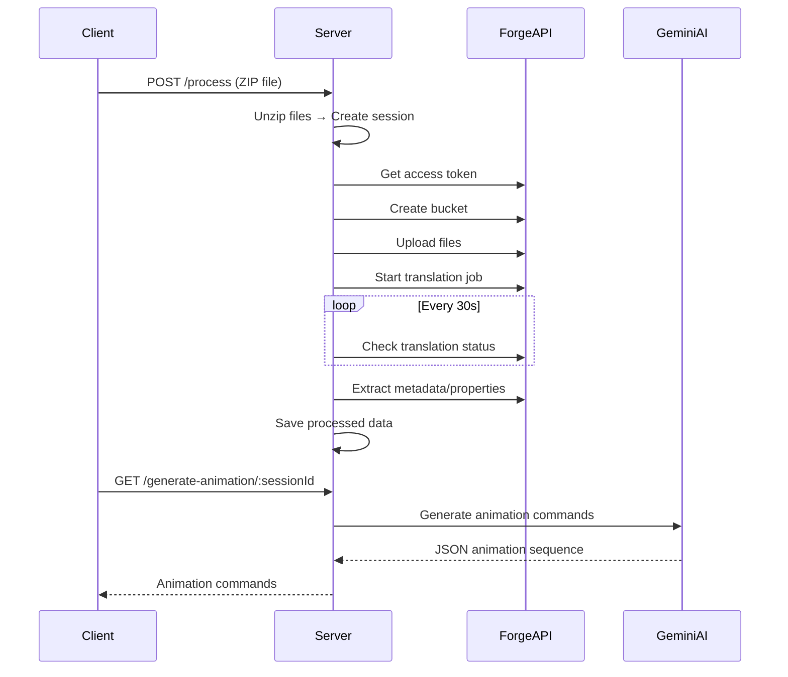

### Project Documentation

#### **Project Overview**
Node.js server that processes CAD assemblies (Inventor files) using Autodesk Forge APIs and generates disassembly animations via Google Gemini AI. It handles:
1. CAD file uploads and processing
2. Autodesk Forge integration for model translation
3. Metadata extraction (hierarchy and properties)
4. AI-generated disassembly animations
5. Session-based progress tracking

---

### **Key Components**
#### 1. Core Technologies
| Technology | Purpose | Version |
|------------|---------|---------|
| Node.js | Runtime environment | 18+ |
| Express | Web server framework | 5.1.0 |
| Autodesk Forge | CAD processing/translation | API v2 |
| Google Gemini | AI animation generation | v1beta |
| Multer | File upload handling | 2.0.1 |
| Adm-Zip | ZIP archive processing | 0.5.16 |
| Axios | HTTP requests | 1.9.0 |

#### 2. File Structure
```
├── server.js (main application)
├── package.json (dependencies)
├── .env (environment variables)
├── uploads/ (user-uploaded files)
└── responses/ (processed data storage)
```

---

### **Workflow Architecture**


---

### **Critical Functions**

#### 1. File Processing Pipeline
```javascript
async function processFiles(sessionId, folderPath, responsePath) {
  // 10-step processing sequence:
  // 1. Get Forge access token
  // 2. Create storage bucket
  // 3. Upload CAD files
  // 4. Detect assembly (.iam) file
  // 5. Link part references
  // 6. Start model translation
  // 7. Monitor translation status
  // 8. Retrieve viewable metadata
  // 9. Extract object hierarchy
  // 10. Fetch all properties
}
```

#### 2. AI Animation Generation
```javascript
app.get('/generate-animation/:sessionId', async (req, res) => {
  // 1. Load hierarchy/properties
  // 2. Construct Gemini prompt
  // 3. Call Gemini API
  // 4. Parse animation commands
  // 5. Return JSON sequence
});
```

#### 3. Session Management
```javascript
const sessions = {}; // In-memory session store

function updateSession(sessionId, update) {
  // Updates session status/progress
}
```

---

### **API Endpoints**
| Endpoint | Method | Description |
|----------|--------|-------------|
| `/process` | POST | Upload ZIP file (multart/form-data) |
| `/status/:sessionId` | GET | Get processing status |
| `/generate-animation/:sessionId` | GET | Generate animation commands |
| `/health` | GET | Server health check |

---

### **Data Flow**
1. **Upload**: 
   - User uploads ZIP → Saved to `uploads/`
   - Session created with UUID
   
2. **Processing**:
   - Files extracted → Uploaded to Forge
   - Assembly translated to SVF2 format
   - Metadata stored in `responses/session_<ID>/`

3. **Animation**:
   - Hierarchy/properties fed to Gemini
   - Returns JSON animation sequence

---

### **Security Considerations**
1. **Authentication**:
   - Forge credentials via env variables
   - Gemini API key secured in .env
   
2. **Data Isolation**:
   - Session-based file segregation
   - UUID-based file naming

3. **Cleanup**:
   - Temporary ZIP deletion after extraction
   - Transient Forge buckets (auto-expire)

---

### **Optimization Opportunities**
1. **Session Storage**:
   - Replace in-memory `sessions` with Redis
   
2. **File Handling**:
   - Implement cloud storage (AWS S3) instead of local FS
   
3. **Error Handling**:
   - Add retry logic for Forge API calls
   - Implement dead-letter queue for failed jobs

4. **Scalability**:
   - Add job queue (Bull.js) for background processing
   - Implement cluster mode for Node.js

5. **Caching**:
   - Cache Gemini responses for similar assemblies

---

### **Installation & Setup**
```bash
# 1. Install dependencies
npm install

# 2. Create .env file
FORGE_CLIENT_ID=your_forge_id
FORGE_CLIENT_SECRET=your_forge_secret
GEMINI_API_KEY=your_gemini_key
PORT=3000

# 3. Start server
node server.js
```

---

### **Usage Guide**
1. **Upload CAD Assembly**:
```bash
curl -X POST http://localhost:3000/process \
  -F "zipfile=@assembly.zip"
```

2. **Check Status**:
```bash
curl http://localhost:3000/status/<sessionId>
```

3. **Generate Animation**:
```bash
curl http://localhost:3000/generate-animation/<sessionId>
```

---

### **Project Dependencies**
```json
{
  "dependencies": {
    "adm-zip": "^0.5.16",
    "axios": "^1.9.0",
    "dotenv": "^16.5.0",
    "express": "^5.1.0",
    "form-data": "^4.0.2",
    "multer": "^2.0.1",
    "uuid": "^11.1.0"
  }
}
```

### **Environment Variables**
| Variable | Required | Description |
|----------|----------|-------------|
| `FORGE_CLIENT_ID` | Yes | Autodesk Forge API ID |
| `FORGE_CLIENT_SECRET` | Yes | Autodesk Forge API secret |
| `GEMINI_API_KEY` | Yes | Google Gemini API key |
| `PORT` | No | Server port (default: 3000) |

---

### **Error Handling**
The system implements:
1. **Session-based error tracking**:
   ```javascript
   catch (error) {
     updateSession(sessionId, {
       status: 'failed',
       error: error.message
     });
   }
   ```
   
2. **API response validation**:
   ```javascript
   if (!response.data.data) {
     throw new Error('No viewable files found');
   }
   ```

3. **HTTP error codes**:
   - 400: Invalid requests
   - 404: Session not found
   - 500: Server errors with details

---


